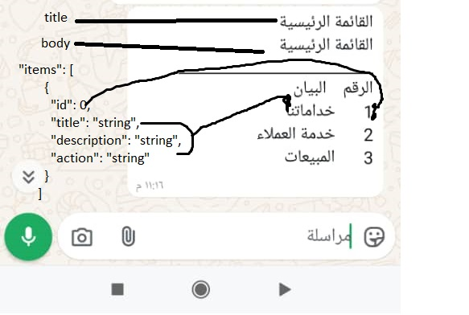

# MalyBotApi

# REST API

The REST API to the example app is described below.

## Application Login
 
### Request

`Post /applogin`

    curl -i -H 'Accept: application/json 'http://109.199.100.162/applogin
    
    body :
     {
      "secretKey": "string",
      "appId": "string"
     }
get secretKey and appId from web site 
### Response

    {
      "code": 0,
      "message": "string",
      "content": {
            "accessToken": "string"
            "expiresIn": 22,
            "tokenType": "Bearer"
          }
    }

## Create Or Update Menu

### Request

`POST /api/Menu/Sync`

    curl -i -H 'Accept: application/json' http://localhost:7000/thing/1
     body :
        {
            "id": 0,
            "menuName": "string",
            "body": "string",
            "buttonText": "string",
            "title": "string",
            "footer": "string",
            "structureType": "string",
            "itemTitle": "string",
            "type": "string",
            "botId": 0,
            "items": [
                {
                "id": 0,
                "title": "string",
                "description": "string",
                "action": "string",
                "menuModelId": 0,
                "isDeleted": true
                }
            ]
        }
`id`: if 0 or null well create new menu  else update menu by id  
`menuName` :Name from Api not Use by bot   
`buttonText`:optional 
`botId` :get by `GET /api/Bot`
`structureType` :Should be `X` 

  

### Response

    {
      "code": int,
      "message": "String",
      "content": "string"
    }

## Get Requset From Bot

### Request

`Get /api/Bot/Requset`

    curl -i -H 'Accept: application/json'  http://localhost:7000/api/Bot/Requse

### Response

       {
          "code": 0,
          "message": "Success",
          "content": [
                    {
                      "clientId": int,
                      "requset_no": int,
                      "from": "string",
                      "doc_type": "string",
                      "containt_type": "string",
                      "menu_no": null,
                      "processed": 0,
                      "action": null,
                      "param": null
                    }
           ]
    }
`clientId` :what is client save requset
`requset_no` :Requset no
`from` : Mobile Number thet sen requset
`doc_type, menu_no,`:null
`processed` :return 0 if not processed else return 1,
`action` : return action from menu item selected

## Send Message

### Request

`P /api/Client/senMessage`

    
    curl -i -H 'Accept: application/json' http://localhost:7000/thing/1
    body:
     {
      "clientId": 0,
      "requset_no": 0,
          "message": {
            "to": "string",
            "contentType": "string",
            "mimType": "string",
            "fileName": "string",
            "menuNo": "string",
            "content": "string",
            "capture": "string"
        }
    }
`clientId` : null
`requset_no`: requset number that response by get requset or null
`to` : mobile number
`mimType` : Text ,Media 
`fileName` : file name if `mimType` Media
`menuNo` :null
`content` :plan text or base64 if `mimType` is Media
`capture` :if `mimType` is Media
### Response

    {
      "code": int,
      "message": "String",
      "content": "string"
    }
`code`:200 if  Success
`message` : Success or error message if not Success
`content` : return Id message if code 200 or error message details
